# AHG Universal Converter

Paste a link. Get the file.

One window for YouTube, Spotify, SoundCloud and short-form video — with artwork and
tags already written into the file. No account, no API keys, nothing to install.

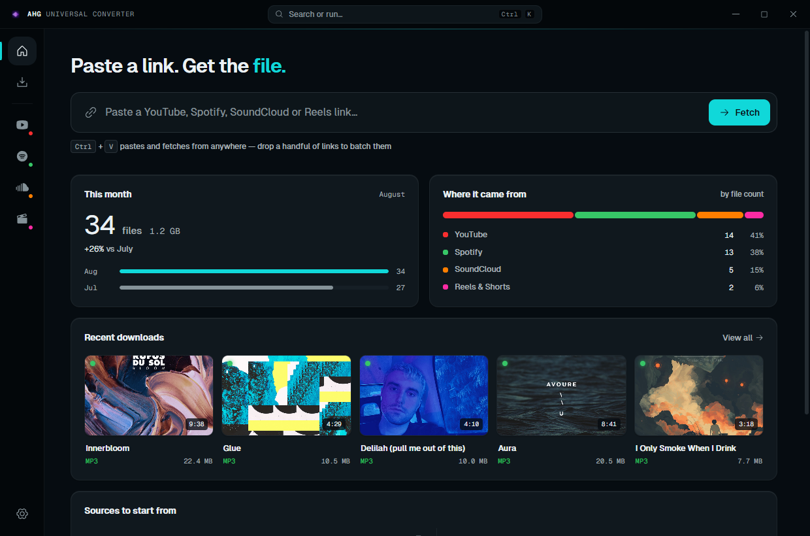

---

## Download

Get the portable `.exe` from the [latest release](https://github.com/amyyne01/UNIVERSAL-CONVERTER-/releases/latest).

It is a single file. Double-click it and the app opens — no installer, no setup
wizard, and nothing written outside its own folder and the downloads directory you
choose. Windows 10 and 11, 64-bit.

You only ever download it once: from then on it updates itself.

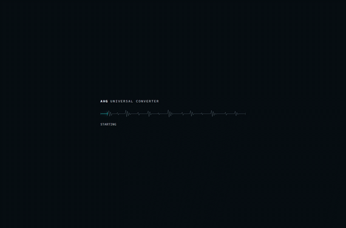

---

## Free, and genuinely usable

The app works without paying for it. Everything below is included:

- **Every source in one field** — paste a YouTube, Spotify, SoundCloud, TikTok,
  Instagram Reels or Facebook link and the right options appear on their own.
- **Search without leaving the app** — type words instead of a link to search
  YouTube or SoundCloud, then download straight from the results.
- **Video up to 1080p**, audio in MP3, AAC, M4A, OGG or Opus at up to 320 kbps.
- **Playlists and albums** — preview the tracklist, tick what you want, take the
  first 20 tracks of any collection.
- **Batch of 5** — paste or drop up to five links at once and they queue together.
- **Artwork and tags written in** — title, artist, album and cover art, embedded.
- **Short-form video without the watermark.**
- **A queue that survives** — pause, resume, cancel, retry; close the app
  mid-download and it offers to finish the job next time you open it.
- **Your own numbers** — what you pulled this month, how it compares to last, and
  which sources it came from.
- **Light and dark**, following your system by default.
- **It keeps itself current** — the app tells you when a new version is out,
  downloads it for you, and swaps itself over on restart. Your settings, your
  download history and your licence all carry across.
- **Ctrl+K** for anything, and a global paste-and-download shortcut you can set.

Every free ceiling is stated up front, on the screen where it applies — you never
find out you hit one only after a download fails.

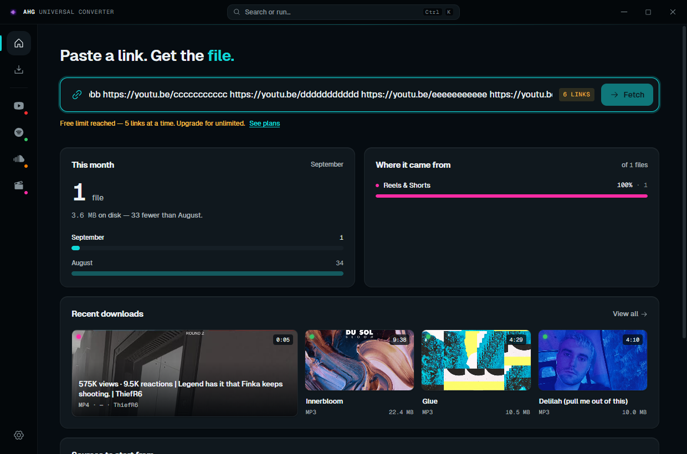

---

## Premium — $3.99, once

Not a subscription. One payment, one machine, moveable to a new PC when you
replace it — release it on the old machine and activate on the new one.

| | Free | Premium |
|---|---|---|
| Video quality | up to 1080p | **up to 4K, or best available** |
| Audio formats | MP3, AAC, M4A, OGG, Opus | **+ FLAC, WAV and ALAC, lossless** |
| Playlists & albums | first 20 tracks | **every track** |
| Batch paste | 5 links at a time | **as many as you paste** |
| Scheduled downloads | — | **run unattended, on your days** |

Everything in the free list stays free. Premium only lifts the ceilings.

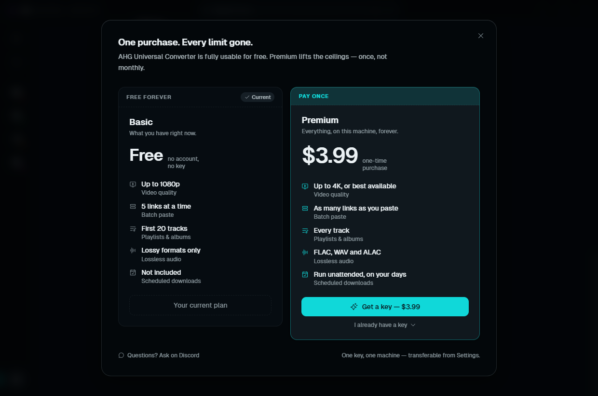

---

## The sources

### YouTube

Videos, playlists and Shorts. Paste a link or search by name, then choose video or
audio before it starts.

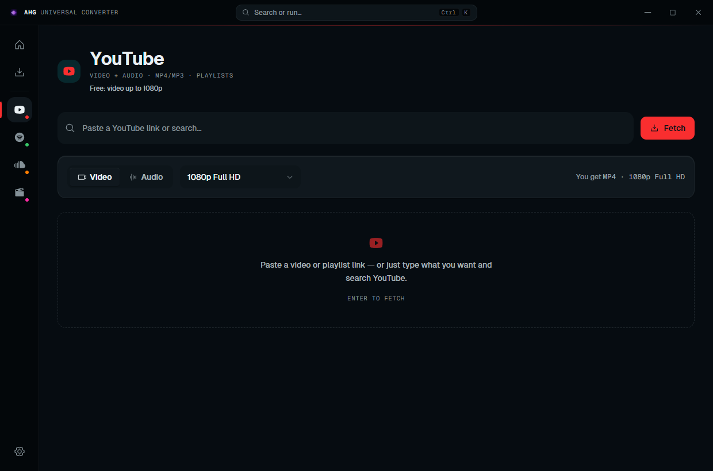

Search results come back in the app, ready to download — no browser round trip.

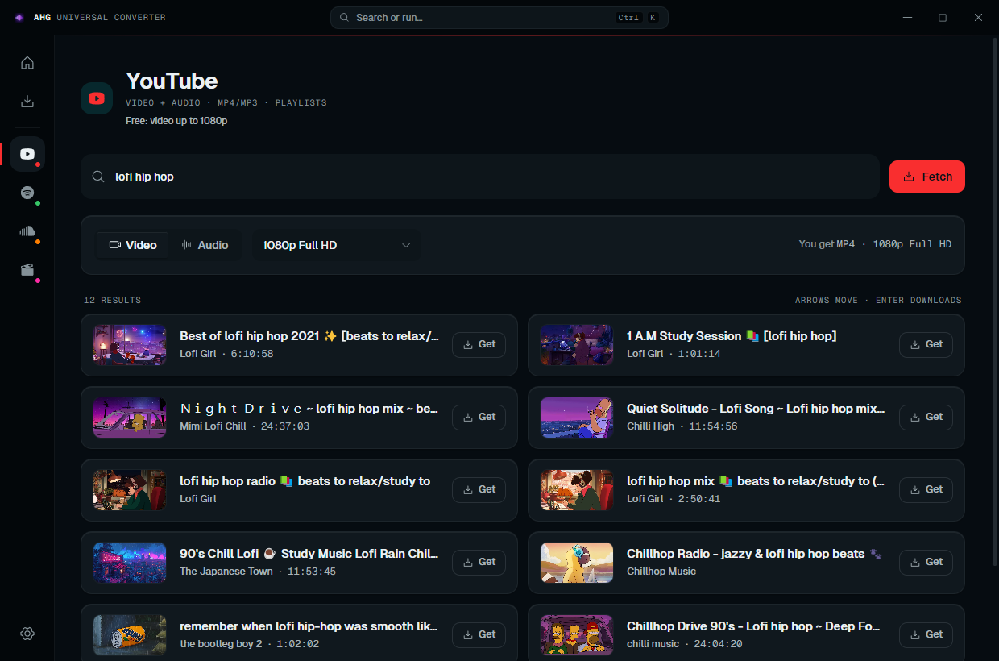

### Spotify

Tracks, albums and playlists, with full metadata and cover art. Pick exactly which
tracks you want from the preview before anything is queued. Lossless formats are
marked, so you always know what you are getting.

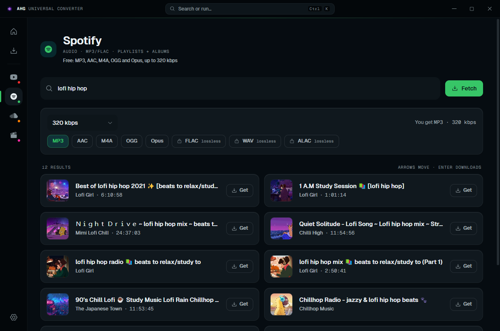

Albums and playlists open as a tracklist you choose from — nothing is queued until
you say so.

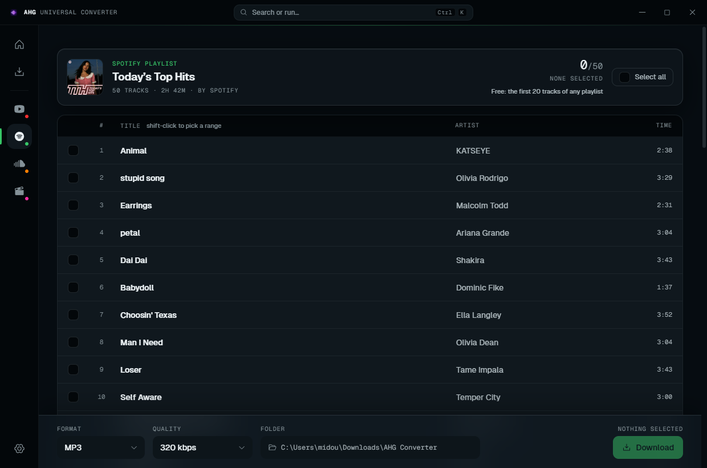

### SoundCloud

Tracks, sets and artist pages, at the quality the upload allows.

### Reels & Shorts

TikTok, Instagram Reels and Facebook video — no watermark.

---

## The queue

Everything in flight and everything finished, in one list: filter by active, done
or failed, select what you want, clear the rest. Each finished row opens the actual
file on disk — and tells you plainly if it has since been moved or deleted.

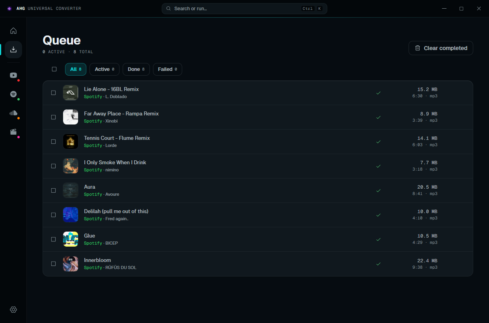

---

## Everything else

Settings keep the parts you tune often within reach: where files land, your default
format and quality, theme, and the extras — bandwidth cap, proxy, a global hotkey,
Discord presence — for when you want them. Nothing needs saving; changes apply as
you make them.

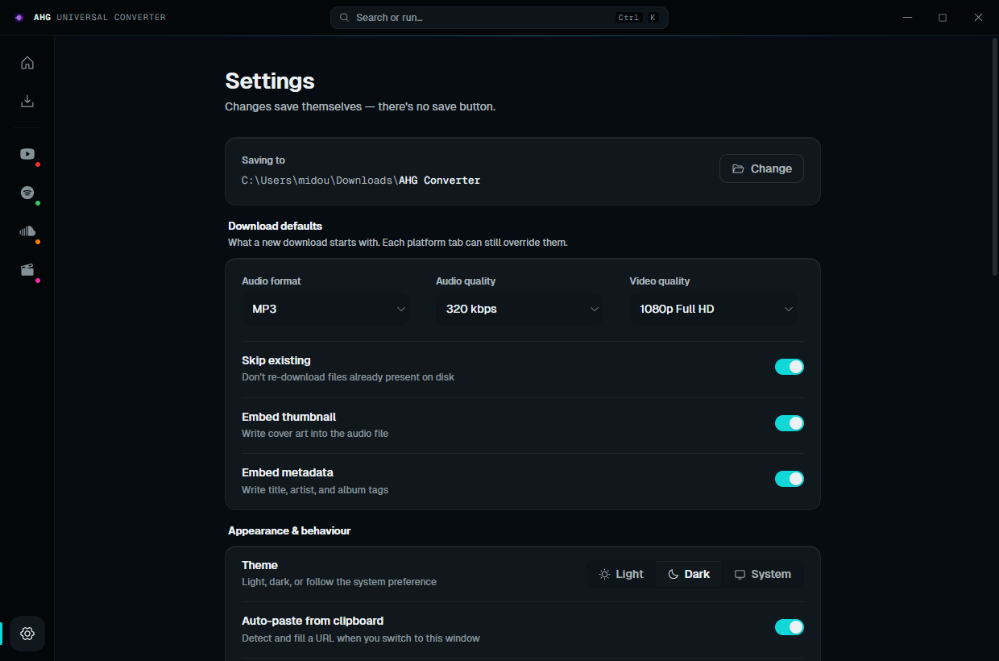

Press **Ctrl+K** anywhere for the command palette: jump to a tab, paste and
download, switch theme, clear the queue.

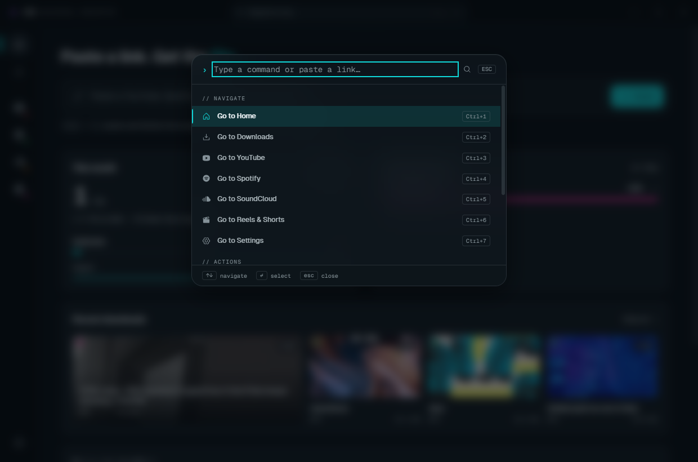

The whole app is at home in light too, and lays out cleanly from a small window up
to a maximised one on a large display.

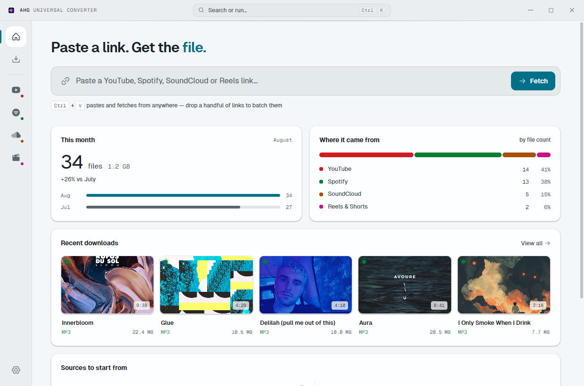

---

## Support

Questions, keys and problems: [Discord](https://discord.gg/NMRgaSQVNx).

---

## License

This is paid software, not an open-source project. No license file is included and
no rights are granted beyond personal use of a purchased copy — all rights reserved.
